# Research Synthesizer

**Enterprise-grade research synthesis powered by dual-LLM reasoning + synthesis architecture**

A lightweight, extensible research-assistant framework that combines deep analytical reasoning with polished report generation. Ingests local and remote documents, builds semantic vector indexes, and produces source-grounded technical outputs using configurable LLM pipelines.

> **Perfect for:** Research teams, knowledge synthesis, competitive analysis, literature reviews, technical due diligence, and rapid prototyping.

---


---

## ✨ Why Research Synthesizer?

### 🚀 **Speed & Responsiveness**
- **Instant UI startup** (~1-2s) with lazy model loading
- **Metadata-based document scanning** 500-1000x faster than hash-based approaches
- **Non-blocking operations** - UI stays responsive during indexing, reranking, synthesis
- **Efficient batch processing** for embeddings and reranking

### 🎯 **Accuracy & Grounding**
- **Dual-LLM architecture**: Separate reasoning (deep analysis) and synthesis (report generation) stages
- **Source-grounded output** - Every claim traceable to original documents
- **Multi-stage validation** - Reasoning validation + synthesis validation + quality checks
- **Smart reranking** - Cross-encoder reranking ensures top-quality results

### 🔀 **Multi-Source Intelligence**
- **Local documents** (PDF, TXT, MD) with semantic search
- **ArXiv papers** for academic research
- **Web search** via Tavily API for current information
- **Automatic deduplication** across sources

### 🛠️ **Developer-Friendly**
- **Modular architecture** - Easy to extend with new LLM providers or retrieval sources
- **Comprehensive configuration** - Control every aspect without code changes
- **Type-safe codebase** - Full type hints and LangGraph state management
- **Async operations** - Background tasks don't block the UI
- **Programmatic API** - Use as a Python library for custom workflows
  
---
## Simplified High-Level System Flow

```mermaid
graph TD
    START["🚀 ResearchSynthesizer<br/>Query Entry Point"] --> CONFIG["Load Config<br/>from YAML"]
    CONFIG --> CREATE_STATE["ResearchState<br/>Empty Containers"]
    
    CREATE_STATE --> WF["WorkflowManager<br/>Orchestrate Pipeline"]
    
    WF --> ROUTE{{"Routing Layer<br/>documents|arxiv|web"}}
    
    %% ========== DOCUMENT RETRIEVAL LAYER ==========
    ROUTE -->|use_docs| DOC_START["📚 Layer 2A: Document Indexing"]
    
    DOC_START --> IDX_MGR["IndexingManager<br/>Coordinate indexing"]
    IDX_MGR --> SCAN["DocumentIndexer<br/>scan_for_new_documents"]
    
    SCAN --> CLASS["SourceTypeClassifier<br/>Detect book vs paper"]
    CLASS --> CHUNK["DocumentIndexer<br/>load_and_split_documents"]
    
    CHUNK --> EMBED_DOC["Embedding Pipeline<br/>cache→compute→store"]
    EMBED_DOC --> CACHE_MGR["EmbeddingsCacheManager<br/>hit rate: 60-80%"]
    
    CACHE_MGR --> VS_MGR["VectorStoreManager<br/>route to FAISS"]
    VS_MGR --> DUAL["DualVectorStoreManager<br/>books & papers indices"]
    
    DUAL --> DOC_SAVE["FAISS Save<br/>disk persistence"]
    
    %% ========== ARXIV RETRIEVAL LAYER ==========
    ROUTE -->|use_arxiv| ARXIV_START["📜 Layer 2B: ArXiv Search"]
    
    ARXIV_START --> ARXIV_QUERY["RetrievalManager<br/>search_arxiv"]
    ARXIV_QUERY --> ARXIV_OPT["QueryOptimizer<br/>refine query"]
    
    ARXIV_OPT --> ARXIV_API["ArXiv API<br/>semantic search"]
    ARXIV_API --> ARXIV_PDF["AsyncPDFTitleEnhancer<br/>optional PDF fetch"]
    
    ARXIV_PDF --> ARXIV_EMBED["Embed to VectorStore<br/>same pipeline"]
    
    %% ========== WEB RETRIEVAL LAYER ==========
    ROUTE -->|use_web| WEB_START["🌐 Layer 2C: Web Search"]
    
    WEB_START --> WEB_QUERY["RetrievalManager<br/>search_web"]
    WEB_QUERY --> TAVILY["Tavily API<br/>semantic search"]
    
    TAVILY --> WEB_FILTER["WebPDFEmbedder<br/>filter_high_relevance"]
    WEB_FILTER --> PDF_MGR["PDFManager<br/>cache & download"]
    
    PDF_MGR --> WEB_EMBED["Embed PDFs<br/>to VectorStore"]
    
    %% ========== LAYER 3: SEARCH & RANKING ==========
    DOC_SAVE --> SEARCH_L["Layer 3: Search & Ranking"]
    ARXIV_EMBED --> SEARCH_L
    WEB_EMBED --> SEARCH_L
    
    SEARCH_L --> OPT_CHECK{{"Query<br/>Optimization?"}}
    OPT_CHECK -->|use_llm| OPT["QueryOptimizer<br/>LLM refine"]
    OPT_CHECK -->|No| DIRECT["Use raw query"]
    
    OPT --> SEMANTIC["RetrievalManager<br/>search_all_indexes"]
    DIRECT --> SEMANTIC
    
    SEMANTIC --> COMBINE["Combine all results<br/>deduplicate"]
    COMBINE --> RERANK["DocumentReranker<br/>cross-encoder scoring"]
    
    RERANK --> WEIGHT["SourceTypeClassifier<br/>apply weights<br/>book>arxiv>web"]
    
    WEIGHT --> SORT["Sort & Truncate<br/>top-K final"]
    
    %% ========== LAYER 4: REASONING PIPELINE ==========
    SORT --> REASON_L["Layer 4: Reasoning with Retry"]
    
    REASON_L --> REASON_C["ReasoningController<br/>coordinate with retry"]
    REASON_C --> REASON_INIT["max_retries=3<br/>feedback=None"]
    
    REASON_INIT --> REASON_LOOP["Retry Loop"]
    REASON_LOOP --> ENGINE["ReasoningEngine<br/>LLM analysis"]
    
    ENGINE --> VALIDATE["ReasoningOutputValidator<br/>schema check"]
    VALIDATE --> VALIDATE_SRC["SourceValidator<br/>citation check"]
    
    VALIDATE_SRC -->|Valid| REASON_OK["✅ Reasoning Complete"]
    VALIDATE_SRC -->|Invalid| FEEDBACK["ReasoningController<br/>generate feedback"]
    
    FEEDBACK --> RETRIES{{"Retries<br/>Remaining?"}}
    RETRIES -->|Yes| ENGINE
    RETRIES -->|No| REASON_OK
    
    %% ========== LAYER 5: SYNTHESIS PIPELINE ==========
    REASON_OK --> SYNTH_L["Layer 5: Synthesis Pipeline"]
    
    SYNTH_L --> MODE_SELECT{{"Synthesis<br/>Mode"}}
    
    MODE_SELECT -->|Single| SINGLE["SynthesisEngine<br/>direct generation"]
    MODE_SELECT -->|Two-Stage| TWO["SynthesisEngine<br/>reasoning→report"]
    
    SINGLE --> SYNTH_CALL["Call LLM<br/>temp=0.3"]
    TWO --> SYNTH_CALL
    
    SYNTH_CALL --> SYNTH_VAL["SynthesisOutputValidator<br/>section check"]
    SYNTH_VAL -->|Valid| SYNTH_OK["✅ Synthesis Valid"]
    SYNTH_VAL -->|Invalid| SYNTH_RETRY["Retry synthesis"]
    SYNTH_RETRY --> SYNTH_CALL
    
    %% ========== LAYER 6: OUTPUT & PERSISTENCE ==========
    SYNTH_OK --> OUTPUT_L["Layer 6: Output & Persistence"]
    
    OUTPUT_L --> FORMAT{{"Format"}}
    FORMAT -->|markdown| MD_FMT["Format Markdown"]
    FORMAT -->|pdf| PDF_FMT["Render PDF"]
    FORMAT -->|json| JSON_FMT["Structure JSON"]
    
    MD_FMT --> SAVE_L["ReportManager<br/>create reports/"]
    PDF_FMT --> SAVE_L
    JSON_FMT --> SAVE_L
    
    SAVE_L --> RETURN_STATE["Return ResearchState<br/>all fields populated"]
    RETURN_STATE --> DONE["✅ Complete<br/>10-30s typical"]
    
    classDef orchestrator fill:#FF6B6B,stroke:#333,color:#fff,stroke-width:3px,font-weight:bold
    classDef manager fill:#4ECDC4,stroke:#333,color:#fff,stroke-width:2px
    classDef processor fill:#FFEAA7,stroke:#333,color:#000,stroke-width:2px
    classDef validator fill:#96CEB4,stroke:#333,color:#fff,stroke-width:2px
    classDef storage fill:#D4A5A5,stroke:#333,color:#fff,stroke-width:2px
    classDef external fill:#FFB6C1,stroke:#333,color:#000,stroke-width:2px
    classDef decision fill:#E8D5C4,stroke:#333,color:#000,stroke-width:2px
    classDef output fill:#DDA15E,stroke:#333,color:#fff,stroke-width:2px
    
    class START,WF,REASON_C,SYNTH_OK,OUTPUT_L orchestrator
    class IDX_MGR,VS_MGR,DUAL,RERANK,REASON_L,SYNTH_L manager
    class ENGINE,WEIGHT,SYNTH_CALL processor
    class VALIDATE,VALIDATE_SRC,SYNTH_VAL validator
    class CACHE_MGR,DOC_SAVE,DUAL storage
    class ARXIV_API,TAVILY,PDF_MGR external
    class ROUTE,OPT_CHECK,RETRIES,MODE_SELECT,FORMAT decision
    class DONE output
```


---

## Key Class Relationships

### Core Orchestrators
- **ResearchSynthesizer**: Main entry point, coordinates all components
- **WorkflowManager**: Executes research pipeline with parallel retrieval
- **ReasoningController**: Manages reasoning phase with retry logic
- **SynthesisController/Engine**: Generates final reports (single or two-stage)

### Retrieval & Indexing
- **IndexingManager**: Coordinates document loading and embedding
- **DocumentIndexer**: Scans, chunks, and classifies documents
- **RetrievalManager**: Manages ArXiv and web searches
- **VectorStoreManager** + **DualVectorStoreManager**: FAISS indices (books/papers)
- **EmbeddingsCacheManager**: SQLite cache with 60-80% hit rate

### Source Management
- **SourceTypeClassifier**: Classifies docs as book/paper/web
- **PDFManager**: Caches and manages PDF downloads
- **WebPDFEmbedder**: Filters and embeds web PDFs
- **AsyncPDFTitleEnhancer**: Enhances PDF metadata

### Search & Ranking
- **DocumentReranker**: Cross-encoder scoring and weighting
- **QueryOptimizer**: Refines queries (optional LLM)

### Validation & Output
- **ReasoningOutputValidator**: Validates prose reasoning
- **SourceValidator**: Checks citation integrity
- **SynthesisOutputValidator**: Validates report structure
- **ReportManager**: Saves in markdown/PDF/JSON formats

### Utilities
- **LoggerConfig**: Centralized logging
- **MinimalCitationProcessor**: Citation formatting
- **ReasoningCapabilityProbe**: Model capability detection
---

## 🎬 Quick Start

### 1. Install

```bash
git clone <repository-url>
cd research-synthesizer-v1
pip install -r requirements.txt
```

### 2. Configure

Edit [config/settings.py](config/settings.py):
```python
"reasoning_model": "deepseek-r1:14b",      # Deep analysis
"synthesis_model": "qwen2.5:7b-instruct",  # Report generation
"embedding_model": "BAAI/bge-base-en-v1.5" # Semantic search
```

### 3. Run

```bash
python main.py
```

Open browser: `http://127.0.0.1:7860`

### 4. Research

1. Add documents to `./research_docs/`
2. Click "Rescan Documents" 
3. Enter your research question
4. Get source-grounded technical report in seconds

---

## 🎯 Core Capabilities

### Dual-LLM Architecture
- **Reasoning Model** (Stage 1): Deep analysis and critical thinking
- **Synthesis Model** (Stage 2): Polished report generation  
- **Single-Stage Mode**: Direct synthesis for speed
- **Lazy Loading**: Models initialize only on first use (instant UI startup)

### Multi-Source Research
- **Local documents**: PDF, TXT, MD with semantic search
- **ArXiv papers**: Direct academic paper search
- **Web search**: Current information via Tavily API
- **Automatic deduplication** across all sources

### Advanced Retrieval & Ranking
- **FAISS vector store** with stat-based document scanning (500-1000x faster than hash-based)
- **Semantic search** with embeddings for relevance
- **Cross-encoder reranking** for quality ranking
- **Batch processing** for efficiency
- **Smart deduplication** across sources and within vectorstore

### UI Features
- **Main Tab**: Research interface with query input and mode selection
- **Reports Tab**: Browse, load, and download previous reports
- **Tools Tab**: Database maintenance (async, non-blocking)
  - Rescan documents
  - Check for duplicates
  - Rebuild indexes
  - Optimize cache
  - Full database reset with backup
- **Config Tab**: Runtime information and status
- **Real-time progress** indicators and task status

---

## 📖 Core Usage Workflow

1. **Add Documents** 
   - Place PDF, TXT, or MD files in `./research_docs/`
   - Click "Rescan Documents" (runs async, non-blocking)

2. **Configure Research** (Optional)
   - Toggle Dual-LLM mode (reasoning + synthesis vs. direct synthesis)
   - Select sources: Local Docs, ArXiv, Web
   - Adjust temperature for creativity vs. consistency

3. **Run Query**
   - Enter research question
   - Click "Research"
   - First run loads models (~30-60s)
   - Subsequent runs use cached models (much faster)

4. **Review & Export**
   - View formatted report with citations
   - Access reasoning analysis (Dual-LLM mode)
   - Download or browse previous reports

---

## 📊 Project Structure

```
research-synthesizer-v1/
├── assets/                       # UI styling
│   └── style.css
├── config/                       # Configuration
│   ├── __init__.py
│   └── settings.py               # All configurable parameters
├── core/                         # Business logic & orchestration
│   ├── synthesizer.py            # Main coordinator
│   ├── state.py                  # Type-safe state management
│   ├── workflow_manager.py        # LangGraph workflow orchestration
│   ├── reasoning_controller.py    # Dual-LLM reasoning stage
│   ├── reasoning_validator.py     # Reasoning output validation
│   ├── synthesis_validator.py     # Synthesis output validation
│   └── report_manager.py          # Report persistence
├── llm/                          # Language model operations
│   ├── reasoning.py              # Deep analysis LLM (Stage 1)
│   ├── synthesis.py              # Report generation LLM (Stage 2)
│   └── query_optimizer.py         # Query refinement (optional)
├── retrieval/                    # Document management & search
│   ├── loader.py                 # Document loading and chunking
│   ├── vectorstore.py            # FAISS vector database operations
│   ├── reranker.py               # Cross-encoder reranking
│   ├── indexing_manager.py        # Document indexing coordination
│   ├── retrieval_manager.py       # Multi-source retrieval
│   ├── embeddings_cache.py        # Embeddings cache management
│   └── source_classifier.py       # Source metadata handling
├── ui/                           # User interface
│   ├── app.py                    # Gradio UI construction
│   ├── handlers.py               # Event handlers & async operations
│   ├── utils.py                  # UI utilities
│   └── img/                      # UI images
├── utils/                        # Shared utilities
│   ├── file.py                   # File operations and signatures
│   ├── text.py                   # Text processing
│   └── references.py             # Citation handling
├── main.py                       # Application entry point
├── requirements.txt              # Python dependencies
└── readme.md                     # This file
```

---

## 🔧 Installation & Configuration

### Requirements
- Python 3.9+
- PyTorch with or without CUDA
- ~8GB RAM minimum (more for larger models)
- ~2GB disk space for vector database

### Step-by-Step Setup

1. **Clone and install**
   ```bash
   git clone <repository-url>
   cd research-synthesizer-v1
   pip install -r requirements.txt
   ```

2. **Configure [config/settings.py](config/settings.py)**
   ```python
   CONFIG_BALANCED = {
       # === Models ===
       "reasoning_model": "deepseek-r1:14b",
       "synthesis_model": "qwen2.5:7b-instruct",
       "embedding_model": "BAAI/bge-base-en-v1.5",
       "reranker_model": "cross-encoder/ms-marco-MiniLM-L-6-v2",
       
       # === Temperature (lower = focused, higher = creative) ===
       "reasoning_temperature": 0.15,
       "synthesis_temperature": 0.3,
       
       # === Token Limits ===
       "context_window": 32768,
       "reasoning_max_tokens": 10240,
       "synthesis_max_tokens": 6144,
       
       # === Retrieval ===
       "top_k_initial": 50,
       "top_k_final": 15,
       "use_reranking": True,
       
       # === Features ===
       "use_two_stage_synthesis": True,
       "use_fast_scan": True,
       "use_llm_query_optimization": True,
       
       # === API Keys (optional) ===
       # "tavily_api_key": "your-key-here",
   }
   ```

3. **Set environment variables** (optional)
   ```bash
   export TAVILY_API_KEY="your-api-key"        # For web search
   export HF_HUB_OFFLINE="1"                   # Run completely offline
   export HF_HUB_DISABLE_TELEMETRY="1"        # Disable telemetry
   ```

4. **Create directories** (auto-created, but you can pre-create)
   ```
   ./research_docs/     # Your documents here
   ./vector_db/         # Vector database (auto-created)
   ./_reports/          # Generated reports
   ./.embeddings_cache/ # Cached embeddings
   ```

5. **Launch the application**
   ```bash
   python main.py
   ```
   
   Application appears at: `http://127.0.0.1:7860`

---

## 💻 Programmatic Usage

Use Research Synthesizer as a Python library:

```python
from core.synthesizer import ResearchSynthesizer
from config.settings import CONFIG_BALANCED

# Initialize
assistant = ResearchSynthesizer(**CONFIG_BALANCED)

# Index documents
assistant.scan_and_load_documents()

# Run research query
report = assistant.research(
    query="What are recent advances in quantum computing?",
    use_docs=True,      # Search local documents
    use_arxiv=True,     # Search ArXiv
    use_web=True,       # Search web (requires API key)
    save_report=True    # Save to reports directory
)

print(report)

# Advanced usage
search_results = assistant.retrieval_manager.search_documents(
    query="quantum computing",
    top_k=10
)

cache_stats = assistant.get_cache_stats()
assistant.optimize_cache(keep_recent=7)

duplicates = assistant.check_for_duplicates()
if duplicates:
    assistant.clear_duplicates_and_rebuild()
```

---

## 🚀 Advanced Features

### Fast Document Scanning

By default, uses **stat-based signatures** (file size + modification time):
- **Speed**: 500-1000x faster than MD5 hashing
- **Automatic migration**: Converts legacy hash-based signatures on first scan
- **Fallback**: Set `use_fast_scan: False` in config for cryptographic verification

```python
from retrieval.loader import DocumentIndexer
indexer = DocumentIndexer(config)
indexer.scan_documents("./research_docs/")
```

### Embeddings Cache Management

Cached embeddings stored in `./.embeddings_cache/` directory:

```python
assistant.get_cache_stats()           # View cache usage
assistant.optimize_cache(keep_recent=7)  # Keep only recent embeddings
assistant.clear_embeddings_cache()     # Remove all cached embeddings
```

### Multi-Source Result Deduplication

The system handles deduplication across sources:
- **Local documents**: Exact match detection via FAISS
- **ArXiv papers**: Metadata-based deduplication
- **Web results**: URL-based deduplication
- **Cross-source**: Semantic similarity handling

### Async Background Operations

All time-consuming operations run in the background without blocking the UI:

```
UI remains responsive while:
├─ Scanning and indexing documents
├─ Checking for embeddings duplicates
├─ Rebuilding vector database
├─ Optimizing cache
└─ Running full database reset (with automatic backup)
```

Status updates display in the Task Status section when operations complete.

---

## 🏗️ System Architecture

### Component Responsibilities

**[config/](config/)** - Centralized configuration
- Single `settings.py` with all configurable parameters
- Easy to modify for different workflows or hardware
- Model paths, batch sizes, retrieval settings, feature toggles

**[core/](core/)** - Business logic orchestration
- `synthesizer.py`: Main coordinator class that initializes and orchestrates all subsystems
- `state.py`: Type-safe state management using LangGraph State objects
- `reasoning_controller.py`: Manages dual-LLM reasoning stage execution
- `reasoning_validator.py`: Validates reasoning output quality and extracts sources
- `synthesis_validator.py`: Validates final synthesis quality
- `report_manager.py`: Saves and loads research reports with metadata
- `workflow_manager.py`: LangGraph workflow orchestration for multi-source research

**[retrieval/](retrieval/)** - Document management and search
- `loader.py`: Fast document scanning, loading, and chunking
  - Stat-based signatures (500-1000x faster than hash-based)
  - Supports PDF, TXT, MD formats
  - Smart migration from legacy hash signatures
- `vectorstore.py`: FAISS vector database operations and persistence
- `reranker.py`: Cross-encoder reranking for improved result quality
- `indexing_manager.py`: Coordinates document indexing and embedding caching
- `embeddings_cache.py`: Manages cached embeddings for performance
- `retrieval_manager.py`: Multi-source retrieval (documents, ArXiv, web)
- `source_classifier.py`: Classifies and normalizes source metadata

**[llm/](llm/)** - Language model operations
- `reasoning.py`: Deep analysis stage (Stage 1 of Dual-LLM)
- `synthesis.py`: Report generation stage (Stage 2 or single-stage)
- `query_optimizer.py`: Optional LLM-based query refinement before search

**[ui/](ui/)** - User interface and async task handling
- `app.py`: Gradio UI construction with theme system and responsive layout
- `handlers.py`: Event handlers and async background task management
- `utils.py`: UI helper functions for status displays and config info

**[utils/](utils/)** - Shared utilities
- `file.py`: Fast file signatures, legacy hash support, document loading
- `text.py`: Text processing, sanitization, chunk preparation
- `references.py`: Citation and reference extraction from documents

### Initialization Order

The `ResearchSynthesizer` class initializes components in this order:

1. Configuration loading
2. Device detection (CUDA/CPU)
3. Embeddings model (with caching)
4. FAISS vector store
5. Document reranker
6. Document indexing manager
7. Retrieval manager
8. LLM engines (lazy loaded on first use)
9. Controllers and validators
10. Report manager
11. Workflow manager

This order is critical because dependencies must be initialized before consumers.

---

## 🛠️ Development & Extension

### Project Architecture Principles

1. **Separation of Concerns**: Each module has a single responsibility
2. **Lazy Loading**: Models initialize only when needed for better UX
3. **Async Operations**: All I/O and long-running tasks run in background
4. **Type Safety**: Extensive use of type hints and LangGraph StateGraph
5. **Configuration-Driven**: Behavior controlled via `config/settings.py`
6. **Modular Retrieval**: Easy to add new search sources (local, web, APIs)

### Adding New Features

**New retrieval source** (e.g., Google Scholar, database API):
1. Create new method in `retrieval/retrieval_manager.py`
2. Add to `WorkflowManager` nodes in `core/workflow_manager.py`
3. Include in state update flow
4. Add configuration option in `config/settings.py`

**New LLM provider** (e.g., Claude, GPT-4, custom model):
1. Create module in `llm/` (e.g., `llm/claude_integration.py`)
2. Inherit from base LLM interface or implement compatible API
3. Add model initialization in `synthesizer.py`
4. Update configuration in `settings.py`

**New UI component or tab**:
1. Add Gradio elements in `ui/app.py`
2. Create handler in `ui/handlers.py` if async operation needed
3. Style with CSS in `assets/style.css`
4. Update layout/structure in appropriate section

### Code Style

- **PEP 8**: Follow Python style guidelines
- **Type Hints**: Always use for function parameters and returns
- **Docstrings**: Module, class, and function level
- **Comments**: Explain "why", not "what"
- **Imports**: Group standard library, third-party, local (alphabetically)
- **Max line length**: 120 characters

### Testing

**Quick validation**:
```bash
# Test document loading
python -c "from core.synthesizer import ResearchSynthesizer; from config.settings import CONFIG_BALANCED; assistant = ResearchSynthesizer(**CONFIG_BALANCED); print('✓ Core system ready')"
```

**Comprehensive testing**:
```bash
pip install pytest flake8 black mypy
python -m pytest tests/ -v
flake8 . --max-line-length=120
mypy . --ignore-missing-imports
```

---

## 🔍 Troubleshooting

### Common Issues and Solutions

**Documents Not Indexing**
- Verify file formats: Only PDF, TXT, MD supported
- Check file permissions in `./research_docs/`
- Check console for errors during rescan
- Rescan runs async - check status panel after moment
- Try "Reset Database" if stuck

**Model Loading Takes Too Long**
- First model load: 30-60 seconds depending on size
- Subsequent queries use cached models (much faster)
- Use smaller models for faster loading
- Check available RAM and GPU memory

**CUDA/GPU Errors**
- Set `"embedding_device": "cpu"` to disable GPU
- Check GPU memory: Reduce `embedding_batch_size`
- Verify PyTorch CUDA: `python -c "import torch; print(torch.cuda.is_available())"`

**Duplicate Embeddings**
- Use "Check Duplicates" tool in Tools tab
- Click "Rebuild Index" if duplicates found
- Last resort: "Reset Database" button (creates backup)

**Web Search Not Working**
- Set `TAVILY_API_KEY` environment variable
- Get key from https://tavily.com
- Verify API key has quota

**Out of Memory Errors**
- Reduce batch sizes: `embedding_batch_size: 32`
- Reduce `top_k_initial` and `top_k_final`
- Use smaller models
- Switch to CPU: `embedding_device: "cpu"`

### Performance Optimization

| Issue | Solution |
|-------|----------|
| Slow document scanning | `use_fast_scan: True` (500-1000x faster) |
| Slow embeddings | Increase `embedding_batch_size` or use GPU |
| Slow reranking | Reduce `top_k_initial` or increase batch size |
| High memory | Reduce `chunk_size` or batch sizes |
| Slow model loading | Use smaller models |

---

## 📚 References

### Key Technologies
- **LangChain**: Orchestration and LLM integration
- **LangGraph**: Workflow state management and graph-based execution
- **FAISS**: Vector similarity search at scale
- **Gradio**: Web UI framework
- **Transformers**: Hugging Face models for embeddings and cross-encoding
- **PyTorch**: Deep learning backend
- **ArXiv API**: Academic paper search
- **Tavily Search API**: Web search integration

### Important Entry Points
- [main.py](main.py) - Application entry point
- [config/settings.py](config/settings.py) - All configuration options
- [core/synthesizer.py](core/synthesizer.py) - Main coordinator class
- [ui/app.py](ui/app.py) - Gradio UI and layout
- [core/workflow_manager.py](core/workflow_manager.py) - LangGraph workflow

---

## License

This repository is for portfolio and showcase purposes only.

The source code is private and not licensed for use, modification, or redistribution.
All rights reserved.


## Support

For questions or general feedback, please open an issue on this repository.
