# Research Synthesizer

**Dual-LLM research synthesis with semantic retrieval and source validation**

Local-first research assistant that combines deep reasoning with report generation. Ingests documents (PDF/TXT/MD), builds FAISS vector indices, and produces source-grounded outputs using configurable LLM pipelines. Optional text-to-speech for hands-free consumption.

> **Use cases:** Literature reviews, competitive analysis, technical due diligence, knowledge synthesis, research prototyping.

---
### ☀️ **UI (Light theme)**


### 🌙 **UI (Dark theme)**


---

## Why This Architecture?

**Performance**
- Stat-based document scanning (500-1000x faster than MD5)
- Lazy model loading (~1-2s UI startup, models load on demand)
- SQLite embeddings cache (60-80% hit rate)
- Async operations keep UI responsive during indexing/synthesis
- Efficient batch processing for embeddings and reranking

**Accuracy**
- Dual-LLM pipeline: reasoning model (analysis) → synthesis model (reports)
- Cross-encoder reranking with source-type weighting (book:1.0, paper:0.95, web:0.7)
- Multi-stage validation: reasoning → synthesis → quality checks
- Citation tracking and source verification

**Flexibility**
- Multi-source retrieval: local documents + ArXiv + web search (Tavily)
- Configurable via `config/settings.py` (no code changes needed)
- Type-safe state management (LangGraph)
- Modular architecture for extending sources/models

---

## Simplified High-Level System Flow

```mermaid
graph TB
    START["🚀 ResearchSynthesizer<br/>Query Input"] --> WF["WorkflowManager<br/>Orchestration"]
    
    WF --> CONFIG["Configuration<br/>Settings & Models"]
    CONFIG --> ROUTE{{"Source<br/>Selection"}}
    
    %% DOCUMENT PATH
    ROUTE -->|Documents| DOC_CHECK{{"Index<br/>Exists?"}}
    DOC_CHECK -->|No| DOC_SCAN["Document Scanner<br/>Detect new files"]
    DOC_CHECK -->|Yes| DOC_LOAD["Load Index<br/>From cache"]
    
    DOC_SCAN --> DOC_CLASSIFY["Source Classifier<br/>BOOK | PAPER"]
    DOC_CLASSIFY --> DOC_CHUNK["Document Chunking<br/>1000 tokens"]
    DOC_CHUNK --> DOC_CACHE_CHK{{"Cache<br/>Hit?"}}
    
    DOC_CACHE_CHK -->|"Yes ~1ms"| DOC_CACHE_LOAD["Embeddings Cache<br/>Fast retrieval"]
    DOC_CACHE_CHK -->|"No ~100ms"| DOC_EMBED["Generate Embeddings<br/>HuggingFace"]
    
    DOC_EMBED --> DOC_CACHE_SAVE["Cache Update"]
    DOC_CACHE_SAVE --> DOC_DUAL
    DOC_CACHE_LOAD --> DOC_DUAL
    DOC_LOAD --> DOC_DUAL
    
    DOC_DUAL["Dual Vector Store<br/>Books & Papers<br/>FAISS"]
    DOC_DUAL --> DOC_SAVE["Save Indices"]
    
    %% ARXIV PATH
    ROUTE -->|ArXiv| ARXIV_OPT["Query Optimizer<br/>LLM expansion"]
    ARXIV_OPT --> ARXIV_API["ArXiv API<br/>50 results"]
    ARXIV_API --> ARXIV_FILTER["Filter & Deduplicate"]
    ARXIV_FILTER --> ARXIV_PDF_CHK{{"Fetch<br/>PDFs?"}}
    
    ARXIV_PDF_CHK -->|Yes| ARXIV_PDF["PDF Downloader<br/>Async batch"]
    ARXIV_PDF_CHK -->|No| ARXIV_EMBED
    ARXIV_PDF --> ARXIV_PARSE["PDF Parser"]
    ARXIV_PARSE --> ARXIV_EMBED["Embedding Generator"]
    
    %% WEB PATH
    ROUTE -->|Web| WEB_OPT["Query Optimizer<br/>LLM expansion"]
    WEB_OPT --> TAVILY["Tavily Search<br/>20 results"]
    TAVILY --> WEB_FILTER["Relevance Filter<br/>Threshold: 0.5"]
    WEB_FILTER --> WEB_PDF_CHK{{"PDF<br/>Content?"}}
    
    WEB_PDF_CHK -->|Yes| PDF_MGR["PDF Manager<br/>Download & Cache<br/>50MB limit"]
    WEB_PDF_CHK -->|No| WEB_PARSE["HTML Parser"]
    
    PDF_MGR --> PDF_PARSE["PDF Extractor"]
    PDF_PARSE --> WEB_EMBED
    WEB_PARSE --> WEB_EMBED
    WEB_EMBED["Embedding Generator"]
    
    %% RETRIEVAL
    DOC_SAVE --> SEARCH["Retrieval Manager<br/>Unified Search<br/>100 candidates"]
    ARXIV_EMBED --> SEARCH
    WEB_EMBED --> SEARCH
    
    SEARCH --> COMBINE["Merge & Deduplicate"]
    COMBINE --> WEIGHT_ADJ["Weight Adjustment<br/>Query-aware"]
    WEIGHT_ADJ --> RERANK["Cross-Encoder Reranker<br/>book:1.0 | paper:0.95 | web:0.7"]
    
    RERANK --> TOP_K["Top-K Selection<br/>50 docs | 100k chars"]
    
    %% REASONING
    TOP_K --> REASON_CTRL["Reasoning Controller<br/>Max retries: 3"]
    REASON_CTRL --> REASON_MODE{{"Mode?"}}
    
    REASON_MODE -->|Structured| REASON_STRUCT["Reasoning Engine<br/>JSON Output<br/>temp: 0.7"]
    REASON_MODE -->|Prose| REASON_PROSE["Reasoning Engine<br/>Prose Output<br/>temp: 0.7"]
    
    REASON_STRUCT --> VAL_STRUCT["Structured Validator<br/>Schema & Citations"]
    REASON_PROSE --> VAL_PROSE["Prose Validator<br/>Format & Sources"]
    
    VAL_STRUCT --> VAL_CHECK_R{{"Valid?"}}
    VAL_PROSE --> VAL_CHECK_R
    
    VAL_CHECK_R -->|No| RETRY_R{{"Retry?"}}
    RETRY_R -->|Yes| FEEDBACK_R["Feedback Generator"]
    FEEDBACK_R --> REASON_CTRL
    RETRY_R -->|No| REASON_FAIL["⚠️ Use Best Attempt"]
    VAL_CHECK_R -->|Yes| REASON_OK["✅ Reasoning Complete"]
    REASON_FAIL --> REASON_OK
    
    %% SYNTHESIS
    REASON_OK --> SYNTH_CTRL["Synthesis Controller<br/>Max retries: 3"]
    SYNTH_CTRL --> SOURCE_VAL["Source Validator"]
    SOURCE_VAL --> SOURCE_VAL_CHK{{"Valid?"}}
    
    SOURCE_VAL_CHK -->|No| SOURCE_FIX["Fix Invalid Sources"]
    SOURCE_VAL_CHK -->|Yes| SYNTH_MODE
    SOURCE_FIX --> SYNTH_MODE
    
    SYNTH_MODE{{"Strategy?"}}
    SYNTH_MODE -->|"2-stage JSON"| SYNTH_2S_JSON["Synthesis Engine<br/>JSON → Report<br/>temp: 0.3"]
    SYNTH_MODE -->|"2-stage Prose"| SYNTH_2S_PROSE["Synthesis Engine<br/>Prose → Enhanced<br/>temp: 0.3"]
    SYNTH_MODE -->|Single| SYNTH_SINGLE["Synthesis Engine<br/>Direct Generation<br/>temp: 0.3"]
    
    SYNTH_2S_JSON --> SYNTH_FORMAT
    SYNTH_2S_PROSE --> SYNTH_FORMAT
    SYNTH_SINGLE --> SYNTH_FORMAT
    
    SYNTH_FORMAT["Style Formatter"]
    SYNTH_FORMAT --> VAL_SYNTH["Synthesis Validator<br/>Completeness Check"]
    
    VAL_SYNTH --> VAL_CHECK_S{{"Valid?"}}
    VAL_CHECK_S -->|No| RETRY_S{{"Retry?"}}
    RETRY_S -->|Yes| FEEDBACK_S["Feedback Generator"]
    FEEDBACK_S --> SYNTH_CTRL
    
    RETRY_S -->|No| SYNTH_FAIL_CHK{{"Hard<br/>Reject?"}}
    SYNTH_FAIL_CHK -->|Yes| SYNTH_REJECT["❌ Error"]
    SYNTH_FAIL_CHK -->|No| SYNTH_WARN["⚠️ Use Best Attempt"]
    
    VAL_CHECK_S -->|Yes| SYNTH_OK["✅ Synthesis Complete"]
    SYNTH_WARN --> SYNTH_OK
    
    %% OUTPUT
    SYNTH_OK --> CLEANUP["Cleanup & Formatting"]
    CLEANUP --> SAVE_CHECK{{"Save?"}}
    
    SAVE_CHECK -->|Yes| FORMAT_SEL{{"Format?"}}
    FORMAT_SEL -->|Markdown| REPORT_MGR
    FORMAT_SEL -->|HTML| REPORT_MGR
    FORMAT_SEL -->|DOCX| REPORT_MGR
    FORMAT_SEL -->|PDF| REPORT_MGR
    
    REPORT_MGR["Report Manager<br/>Timestamped Output"]
    
    SAVE_CHECK -->|No| VIZ_CHECK
    REPORT_MGR --> VIZ_CHECK
    
    VIZ_CHECK{{"Visualize?"}}
    VIZ_CHECK -->|Yes| VIZ_GEN["Visualization<br/>Network Graph"]
    VIZ_CHECK -->|No| TTS_CHECK
    VIZ_GEN --> TTS_CHECK
    
    TTS_CHECK{{"TTS?"}}
    TTS_CHECK -->|Yes| TTS_PROCESS["Text-to-Speech<br/>Audio Output"]
    TTS_CHECK -->|No| METRICS
    TTS_PROCESS --> METRICS
    
    METRICS["Metrics Logger<br/>10-30s total"]
    METRICS --> DONE["✅ Complete"]
    
    SYNTH_REJECT --> ERROR_HANDLER["Error Handler"]
    ERROR_HANDLER --> END_ERROR["❌ Failed"]
    
    %% STYLING
    classDef entry fill:#1A365D,stroke:#0F2942,stroke-width:4px,color:#FFF,font-weight:bold
    classDef orchestrator fill:#2C5282,stroke:#1A365D,stroke-width:3px,color:#FFF,font-weight:bold
    classDef processor fill:#4A90C7,stroke:#2C5282,stroke-width:2px,color:#FFF
    classDef llm fill:#5B9FCF,stroke:#4A90C7,stroke-width:2px,color:#FFF
    classDef storage fill:#64748B,stroke:#475569,stroke-width:2px,color:#FFF
    classDef api fill:#7CB8E0,stroke:#5B9FCF,stroke-width:2px,color:#1A202C
    classDef validator fill:#2F855A,stroke:#22543D,stroke-width:2px,color:#FFF
    classDef decision fill:#718096,stroke:#4A5568,stroke-width:2px,color:#FFF
    classDef success fill:#38A169,stroke:#2F855A,stroke-width:3px,color:#FFF,font-weight:bold
    classDef warning fill:#DD6B20,stroke:#C05621,stroke-width:3px,color:#FFF,font-weight:bold
    classDef error fill:#E53E3E,stroke:#C53030,stroke-width:3px,color:#FFF,font-weight:bold
    classDef io fill:#E2E8F0,stroke:#A0AEC0,stroke-width:2px,color:#2D3748
    classDef cache fill:#90CDF4,stroke:#63B3ED,stroke-width:2px,color:#1A202C
    
    class START entry
    class WF,REASON_CTRL,SYNTH_CTRL orchestrator
    class DOC_SCAN,DOC_CLASSIFY,DOC_CHUNK,COMBINE,WEIGHT_ADJ,RERANK,TOP_K,CLEANUP processor
    class REASON_STRUCT,REASON_PROSE,SYNTH_2S_JSON,SYNTH_2S_PROSE,SYNTH_SINGLE,ARXIV_OPT,WEB_OPT llm
    class DOC_DUAL,DOC_SAVE,ARXIV_EMBED,WEB_EMBED,SEARCH storage
    class ARXIV_API,TAVILY,ARXIV_PDF,PDF_MGR,WEB_FILTER api
    class VAL_STRUCT,VAL_PROSE,VAL_SYNTH,SOURCE_VAL validator
    class ROUTE,DOC_CHECK,DOC_CACHE_CHK,ARXIV_PDF_CHK,WEB_PDF_CHECK,REASON_MODE,VAL_CHECK_R,RETRY_R,SOURCE_VAL_CHK,SYNTH_MODE,VAL_CHECK_S,RETRY_S,SYNTH_FAIL_CHK,SAVE_CHECK,FORMAT_SEL,VIZ_CHECK,TTS_CHECK decision
    class REASON_OK,SYNTH_OK,DONE success
    class REASON_FAIL,SYNTH_WARN warning
    class SYNTH_REJECT,ERROR_HANDLER,END_ERROR error
    class CONFIG,SAVE_MD,SAVE_HTML,SAVE_DOCX,SAVE_PDF,REPORT_MGR,VIZ_GEN,TTS_PROCESS,METRICS io
    class DOC_CACHE_LOAD,DOC_CACHE_SAVE,DOC_EMBED,DOC_LOAD cache
```



---

## Architecture Overview

### Core Components

**Orchestration**
- `ResearchSynthesizer` - Main coordinator, initializes subsystems
- `WorkflowManager` - LangGraph-based pipeline execution
- `ReasoningController` - Manages reasoning phase with retry logic
- `SynthesisController` - Manages synthesis phase with validation

**Retrieval & Indexing**
- `IndexingManager` - Coordinates document loading and embedding
- `DocumentIndexer` - Scans/chunks/classifies documents (stat-based signatures)
- `RetrievalManager` - Multi-source search (local, ArXiv, web)
- `VectorStoreManager` + `DualVectorStoreManager` - FAISS indices (books/papers split)
- `EmbeddingsCacheManager` - SQLite cache for embeddings

**Search & Ranking**
- `DocumentReranker` - Cross-encoder reranking with source weighting
- `QueryOptimizer` - LLM-based query expansion (optional)
- `SourceTypeClassifier` - Document classification and weight assignment

**LLM Pipeline**
- `ReasoningEngine` - Deep analysis (structured JSON or prose)
- `SynthesisEngine` - Report generation (single or two-stage)
- Model registry with lazy loading

**Validation**
- `StructuredReasoningValidator` - Schema/citation validation
- `ReasoningOutputValidator` - Prose format validation
- `SynthesisOutputValidator` - Report completeness checks
- `SourceValidator` - Citation integrity verification

**I/O**
- `ReportManager` - Multi-format output (MD, HTML, DOCX, PDF)
- `PDFManager` - PDF caching and management
- `WebPDFEmbedder` - Web content filtering and embedding

---

## Quick Start

```bash
# 1. Clone and install
git clone <repo-url>
cd research-synthesizer-v1
pip install -r requirements.txt

# 2. Configure models (config/settings.py)
CONFIG = {
    "reasoning_model": "deepseek-r1:14b",
    "synthesis_model": "qwen3:14b",
    "embedding_model": "BAAI/bge-base-en-v1.5",
}

# 3. Launch
python main.py
# → http://127.0.0.1:7860

# 4. Add documents to ./research_docs/, rescan, query
```

---

## Configuration

All settings in `config/settings.py`:

```python
CONFIG = {
    # Models
    "reasoning_model": "deepseek-r1:14b",      # Analysis LLM
    "synthesis_model": "qwen3:14b",            # Report LLM
    "embedding_model": "BAAI/bge-base-en-v1.5", # Embeddings
    "reranker_model": "cross-encoder/ms-marco-MiniLM-L-6-v2",
    
    # Temperature (lower = focused, higher = creative)
    "reasoning_temperature": 0.6,
    "synthesis_temperature": 0.3,
    
    # Context (optimized for 32k models)
    "context_window": 32000,
    "reasoning_max_tokens": 5000,
    "synthesis_max_tokens": 8000,
    
    # Retrieval
    "top_k_initial": 50,        # Candidates before reranking
    "top_k_final": 14,          # After reranking
    "chunk_size": 1200,
    "chunk_overlap": 250,
    
    # Features
    "use_two_stage_synthesis": True,
    "use_structured_reasoning": True,
    "use_llm_query_optimization": True,
    "use_reranking": True,
    "use_fast_scan": True,      # Stat-based (500-1000x faster)
    
    # Validation profiles: "strict", "balanced", "flexible", "novelty", "minimal"
    "reasoning_validation_profile": "flexible",
}
```

**LLM Profiles** (preconfigured sets):
- `research` - DeepSeek R1:14b + Qwen3:14b (research-grade)
- `executive` - Qwen3:14b + GPT-OSS:20b (polished output)
- `budget` - DeepSeek R1:8b + Qwen3:8b (efficient)

---

## Usage

### UI Workflow
1. **Add documents** to `./research_docs/` (PDF/TXT/MD)
2. **Rescan** (async, non-blocking)
3. **Configure** sources (local/ArXiv/web) and mode (dual-LLM/single-stage)
4. **Query** → view report with citations
5. **Export** (MD/HTML/DOCX/PDF) or enable TTS playback

### Programmatic API

```python
from core.synthesizer import ResearchSynthesizer
from config.settings import CONFIG

# Initialize
assistant = ResearchSynthesizer(**CONFIG)
assistant.scan_and_load_documents()

# Research query
report = assistant.research(
    query="Recent advances in quantum error correction",
    use_docs=True,
    use_arxiv=True,
    use_web=True,
    save_report=True
)

# Utilities
stats = assistant.get_cache_stats()
assistant.optimize_cache(keep_recent=7)
duplicates = assistant.check_for_duplicates()
```

---

## Project Structure

```
research-synthesizer-v1/
├── config/
│   └── settings.py               # All configuration
├── core/
│   ├── synthesizer.py            # Main coordinator
│   ├── workflow_manager.py       # LangGraph pipeline
│   ├── reasoning_controller.py   # Reasoning orchestration
│   ├── synthesis_controller.py   # Synthesis orchestration
│   ├── state.py                  # Type-safe state
│   └── output/
│       └── report_manager.py     # Report I/O
├── llm/
│   ├── reasoning.py              # Analysis engine
│   ├── synthesis.py              # Report engine
│   ├── query_optimizer.py        # Query expansion
│   └── model_registry.py         # Model management
├── retrieval/
│   ├── indexing/
│   │   ├── indexing_manager.py   # Document coordination
│   │   ├── loader.py             # Scanning/chunking
│   │   └── source_classifier.py  # Type detection
│   ├── search/
│   │   ├── retrieval_manager.py  # Multi-source search
│   │   └── reranker.py           # Cross-encoder ranking
│   ├── vectordb/
│   │   ├── vectorstore.py        # FAISS manager
│   │   ├── dual_manager.py       # Books/papers split
│   │   └── embeddings_cache.py   # SQLite cache
│   └── sources/
│       ├── pdf_manager.py        # PDF caching
│       └── web_pdf_embedder.py   # Web filtering
├── core/validation/
│   ├── structured_reasoning_validator.py
│   ├── prose_reasoning_validator.py
│   ├── synthesis_validator.py
│   └── source_validator.py
├── ui/
│   ├── app.py                    # Gradio UI
│   ├── handlers/                 # Event handlers
│   └── utils.py                  # UI utilities
├── utils/
│   ├── file.py                   # Fast signatures
│   ├── text.py                   # Processing
│   └── tts_parsers.py            # Audio formatting
└── main.py                       # Entry point
```

---

## Key Features

**Fast Document Scanning**
- Stat-based signatures (file size + mtime) - 500-1000x faster than MD5
- Automatic migration from legacy hash-based indices
- Fallback to hash verification: `use_fast_scan: False`

**Embeddings Cache**
- SQLite storage in `./.embeddings_cache/`
- 60-80% hit rate on typical workloads
- Optimize: `assistant.optimize_cache(keep_recent=7)`

**Validation Profiles**
- `strict` - High quality bar (min 2500 words, 10+ claims)
- `balanced` - Production default
- `flexible` - Optimized for DeepSeek R1 reasoning style
- `novelty` - For creative insights and hypotheses
- `minimal` - Structure only

**Async Operations**
All long-running tasks (indexing, duplicates check, cache optimization, database rebuild) run in background threads. UI stays responsive with status updates.

---

## Troubleshooting

| Issue | Solution |
|-------|----------|
| Slow scanning | Enable `use_fast_scan: True` |
| Out of memory | Reduce batch sizes or switch to CPU |
| Model loading slow | First load is 30-60s, subsequent queries use cached models |
| Documents not indexing | Check file formats (PDF/TXT/MD only), verify permissions |
| Web search failing | Set `TAVILY_API_KEY` environment variable |
| Duplicate embeddings | Run "Check Duplicates" → "Rebuild Index" in Tools tab |

**Performance Tuning**
```python
# Reduce memory usage
"embedding_batch_size": 32,  # Lower if OOM
"reranker_batch_size": 16,
"top_k_initial": 30,         # Fewer candidates

# Increase throughput
"embedding_batch_size": 128,  # If GPU available
"num_threads": 8,
```

---

## Technology Stack

- **LangChain** - LLM orchestration
- **LangGraph** - State management and workflow graphs
- **FAISS** - Vector similarity search
- **Gradio** - Web UI
- **Transformers** - HuggingFace embeddings and cross-encoders
- **PyTorch** - Deep learning backend
- **ArXiv API** - Academic paper search
- **Tavily** - Web search integration
- **Piper TTS** - Text-to-speech

---

## License

Portfolio showcase project. Source code is private and not licensed for use, modification, or redistribution. All rights reserved.

For questions or feedback, open an issue on this repository.
